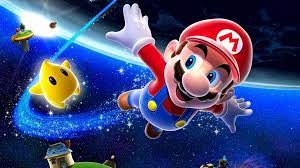

# My Favorite Game
My favorite game is *Super Mario Galaxy*, originally released for the Nintendo Wii in 2007. The storyline, soundtrack, and gameplay are unmatched in my opinion. I am also a fan of the game's pioneering use of spherical/planetary gravity.

It was released by [Nintendo](https://www.nintendo.com/us/) on November 1st, 2007. It was implemented using the custom Super Mario Galaxy Engine, designed specifically for the game.

Some similar games include [*New Super Mario Bros Wii*](https://www.mariowiki.com/New_Super_Mario_Bros._Wii), [*Super Mario Galaxy 2*](https://www.mariowiki.com/Super_Mario_Galaxy_2), and [*Super Mario 64*](https://www.mariowiki.com/Super_Mario_64).

